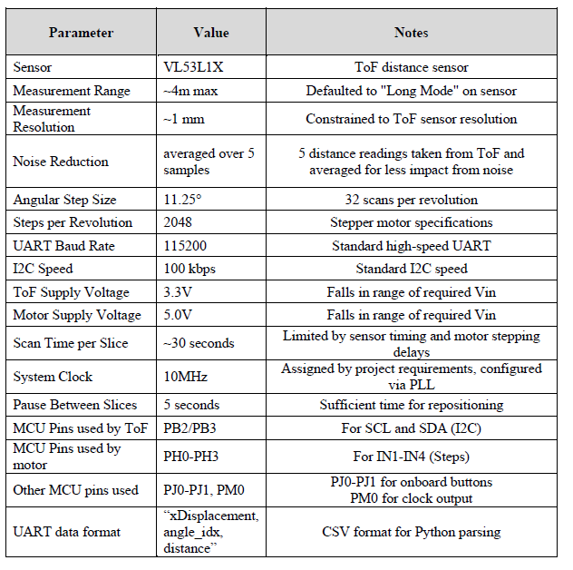
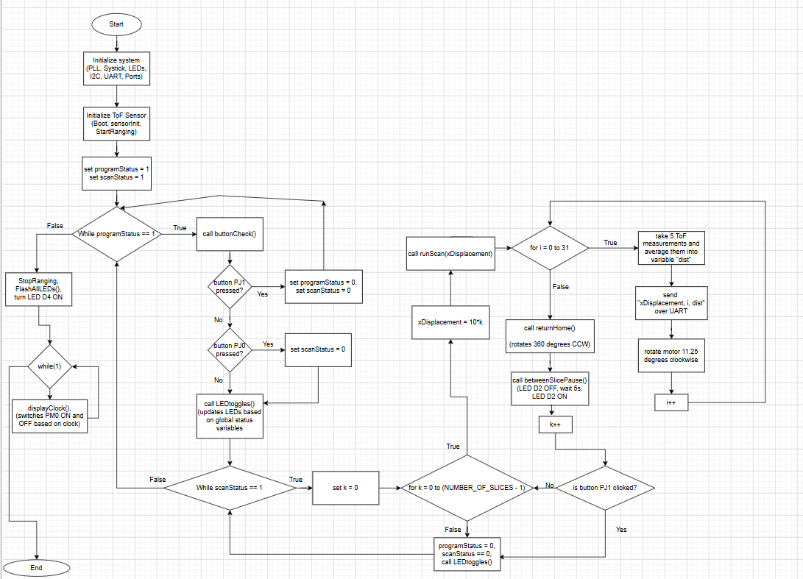
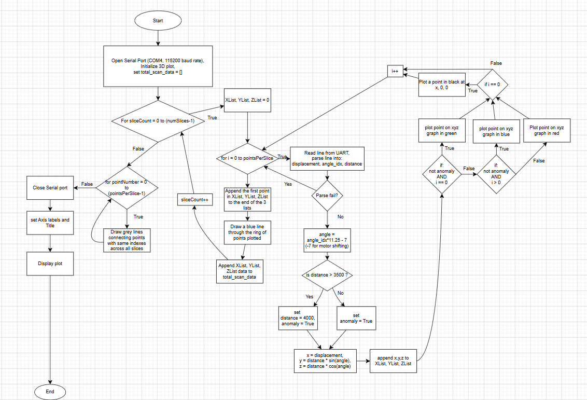
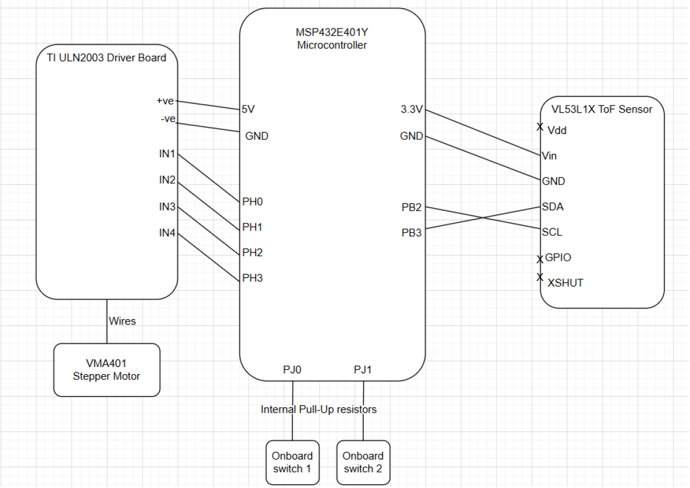
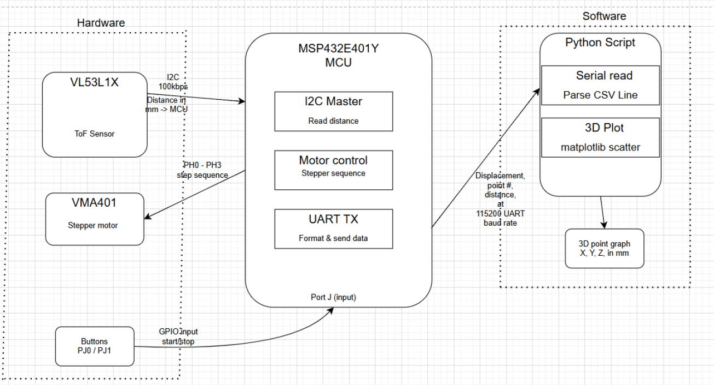
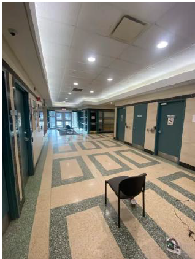
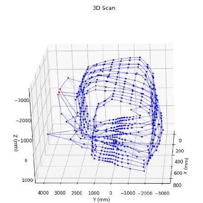
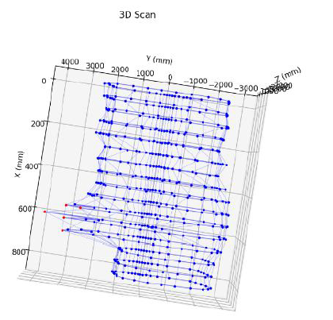

# 3D-Environment-Scanning-Device
## Description:

Embedded C Firmware + Python visualization system which utilizes an ARM Cortex-M4 MCU, VL53L1X Time of Flight sensor, and a stepper motor into a 3D environment scanner, reconstructing physical rooms into 3D interactive point cloud plots.

--------------------------------

## Overview:

The system operates by using a stepper motor to incrementally rotate the sensor in a 360o scan, where the sensor collects distance readings between increments, resulting in multiple distance values across angle increments in the scan. These 360o scans, which will be referred to as “slices”, are then repeated multiple times as the device is moved, to generate a 3D model of the surroundings with many slices.
The distance data is collected from the sensor via I2C at 100kbps and then transferred to the PC from the MCU using UART at 115200 baud formatted as CSV. A Python-based program then receives the data and processes it, handling anomaly detection and scaling, to construct an interactive 3D model by converting polar measurements into Cartesian coordinates using trigonometric equations.

--------------------------------

## Key Specifications:

*Characteristic Table*

--------------------------------

## Functionality:

### Firmware (MCU):

Initialises the system clock and sensor, then pulls onboard buttons to begin or end scanning. The stepper motor is rotated 360deg incrementally, with the ToF sensor taking the average of 5 distance measurements (between motor rotation increments). The MCU transmits the required data in CSV format to the PC via UART. A flowchart is shown below, since ***the full MCU firmware source code is not publicly displayed to avoid infringement of academic integrity policies.***

*C program flowchart*

### Python Visualization (PC):

The Python program [(Python Program Link)](Python_Visualization/Graphing.py) reads the incoming UART stream using Python's Serial library, and parses it into (xDisplacement, angle, distance), to convert them into cartesian coordinates. The anomaly readings are flagged, and a live 3D scatter plot is built. Combining all slices together,the result is multiple scans being joined together, creating a 3D model of the room using Python's Matplotlib library. Below is a flowchart of the program.

*Python program flowchart*

--------------------------------

## Hardware Schematics:

*System schematic*

*Block Diagram*

The schematic and block diagram above show how the hardware was connected and communicated with each other.

    - The VL53L1X ToF sensor was connected to the MCU, over I2C.

    - The stepper motor and its driver (ULN2003) was connected to the MCU via GPIO pins.

    - The Onboard buttons were connected by internal GPIO.

    - The MCU was connected to the PC over UART (USB) at 115200 baud.

-------------------------------

## Results:

Below are the results of the system scanning the shown hallway

*Picture of the hallway scanned*

*Front view of the 3D model*

*Top view of the 3D model*

The blue points are valid readings, along with lines connecting the points and slices to provide a visually-pleasing model. The red points represent anomaly readings, correctly showing that the scanned hallway is met with another perpendicular hallway which the sensor could not read properly.